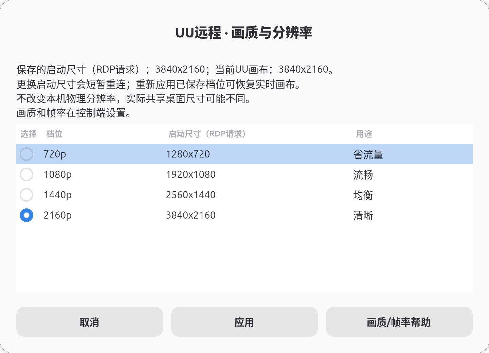
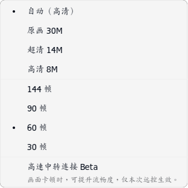

[English](../../quality-guide.md) · [العربية](../ar/quality-guide.md) · [Deutsch](../de/quality-guide.md) · [Español](../es/quality-guide.md) · [Français](../fr/quality-guide.md) · [日本語](../ja/quality-guide.md) · [한국어](../ko/quality-guide.md) · [Русский](../ru/quality-guide.md) · [Tiếng Việt](../vi/quality-guide.md) · [简体中文](../zh-Hans/quality-guide.md) · [繁體中文](../zh-Hant/quality-guide.md)

[Inicio](../../../i18n/README.es.md)

# Calidad, resolución y frecuencia de imagen

Elija el lienzo en Ubuntu y ajuste la transmisión desde el ordenador o teléfono que lo controla. Tamaño, compresión, FPS solicitados y límite de bitrate son controles independientes.

## Elegir el lienzo

Abra **UU Remote 画质与分辨率** en GNOME o ejecute:

```bash
uu-remote quality gui
uu-remote quality list
uu-remote quality status
uu-remote quality apply 2160p
uu-remote quality guide
```



| Perfil | Lienzo | Uso |
| --- | --- | --- |
| `720p` | 1280 × 720 | Pantalla pequeña o conexión limitada |
| `1080p` | 1920 × 1080 | Uso diario; valor inicial |
| `1440p` | 2560 × 1440 | Más espacio con menos píxeles que 4K |
| `2160p` | 3840 × 2160 | Texto fino y escritorio 4K completo |

La reinstalación conserva la selección. El ajuste inteligente encaja todo el escritorio y transforma las coordenadas del puntero con la misma geometría. La resolución y proporción de origen afectan al resultado; el lienzo no cambia la pantalla física y la captura puede procesar el origen completo.

El selector distingue tamaño guardado de arranque/RDP y lienzo actual. Cambiar el guardado provoca una breve reconexión; volver a aplicar el perfil guardado restaura el lienzo en vivo por la ruta RDP compatible sin reiniciar el relé y verifica su tamaño. Antes del cambio se activa un temporizador que restaura la configuración anterior si el puente no queda listo. Espere a que termine la recuperación.

Los perfiles fijos usan `--follow-desktop-resolution off`, predeterminado del instalador. Si activó el seguimiento, desactívelo antes. Consulte [instalación](../../../i18n/README.es.md) y `./install.sh --help`. Ampliar el origen 4K probado a 5K empeoró la imagen en Mac sin añadir detalle; las opciones normales terminan en 4K. Los modos nominales de 60 Hz describen la pantalla virtual; los FPS reales dependen de toda la conexión.

## Calidad y FPS del controlador

Ordenador: **控制中心 → 画质**. Teléfono: **操作 → 显示**. True Color se elige también en el controlador cuando está disponible.



El ejemplo corresponde a Ubuntu controlando un Mac. Dispositivos y códec determinan las opciones. La calidad cambia compresión y detalle; FPS indica la frecuencia solicitada. True Color mejora texto coloreado y bordes. Si UU limita la calidad por rendimiento del dispositivo, elija un nivel disponible. Compare el mismo texto y movimiento.

Documentación de NetEase: [FPS / Super Screen](https://uuyc.163.com/help/superscreen.html) · [True Color](https://uuyc.163.com/features/color/) · [UU](https://uuyc.163.com/help/20241216/40221_1200122.html). Super Screen/controlador virtual en Wine y 144 FPS están pendientes. Consulte [mediciones](performance-evidence.md).

## Límite de bitrate

```bash
uu-remote quality bitrate 20
uu-remote quality bitrate 0
```

`20` solicita un máximo de **20 Mbps**; `0` lo elimina. No fija un bitrate objetivo, FPS ni tamaño. Cambiar resolución conserva este ajuste. Un límite bajo puede reducir el detalle en movimiento.

## Cursor y acciones del escritorio

La protección opcional del cursor está desactivada en instalaciones nuevas. Para un puntero demasiado grande:

```bash
./install.sh --skip-packages --skip-account-login --cursor-guard on --cursor-size 24
```

`--cursor-size auto` sigue el tamaño del escritorio; valores fijos: 24–128 píxeles. Los ajustes de GNOME y aplicaciones son independientes. El Dock sigue GNOME. Mostrar escritorio/todas las ventanas de Android se mapea al escritorio/vista general; falta probar los botones reales.

## Gestión y recuperación

`uu-remote open` abre el visor separado. Para ampliarlo:

```bash
UURB_WINDOW_SCALE=2 ./install.sh --skip-packages --skip-account-login
```

Escalas: `1` (predeterminada), `1.5`, `2`, `3`. Cambia el visor, no DPI de Wine ni resolución. Su portapapeles está aislado; copiar/pegar en el escritorio usa el relé.

```bash
uu-remote status
uu-remote quality status
uu-remote network
uu-remote logs
```

El servicio de usuario reinicia componentes fallidos con posible reconexión. La reversión de perfiles recupera ajustes; el despliegue tiene su propio procedimiento. Véanse [problemas](troubleshooting.md) y [compilación](source-build.md). Controlar otro equipo desde Wine tiene límites distintos. Apagado/encendido del monitor y salidas virtuales están pendientes: [Ubuntu 26.04](ubuntu-26.04-port.md). La cadena teléfono → ToDesk → Mac → UU aún repite texto; las conexiones directas funcionan.
