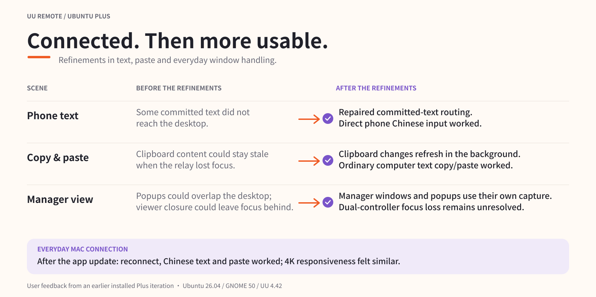
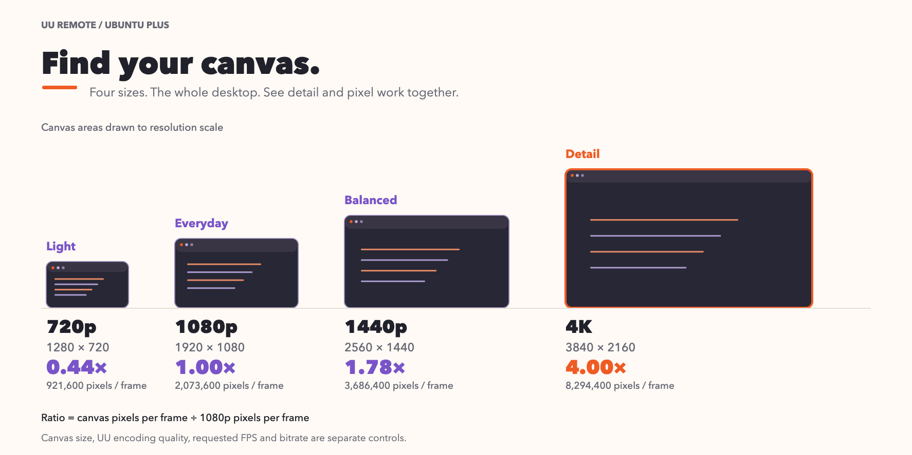
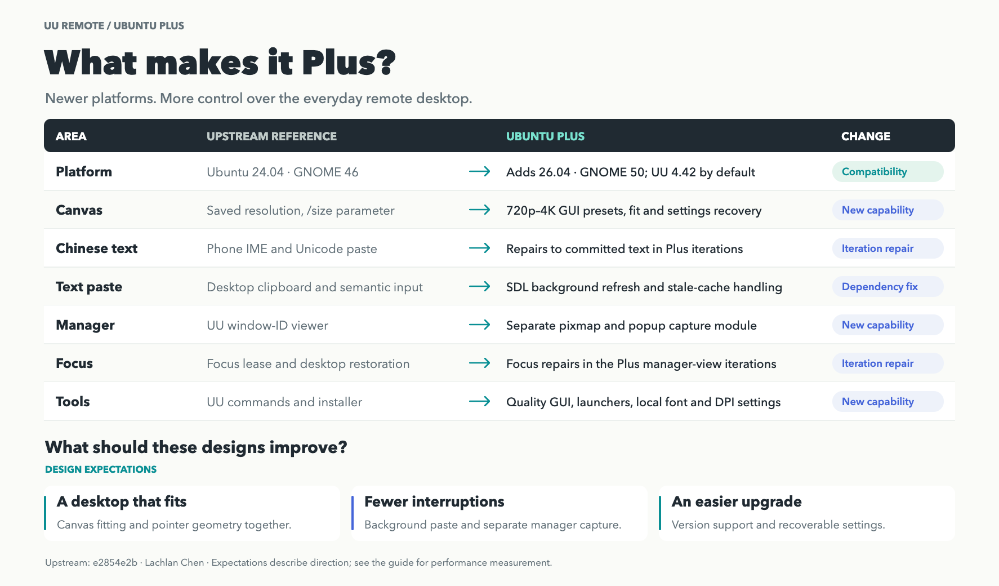

[English](../../performance-evidence.md) · [العربية](../ar/performance-evidence.md) · [Deutsch](../de/performance-evidence.md) · [Español](../es/performance-evidence.md) · [Français](../fr/performance-evidence.md) · [日本語](../ja/performance-evidence.md) · [한국어](../ko/performance-evidence.md) · [Русский](../ru/performance-evidence.md) · [Tiếng Việt](../vi/performance-evidence.md) · [简体中文](../zh-Hans/performance-evidence.md) · [繁體中文](../zh-Hant/performance-evidence.md)

[홈](../../../i18n/README.ko.md)

# 사용 경험과 성능

[편집 가능한 SVG](../../images/experience-refinements-en.svg)

[편집 가능한 SVG](../../images/canvas-pixel-scale-en.svg)

화면/연결에 맞게720p/1080p/1440p/4K를 고릅니다. 화질, 요청FPS, 비트레이트는 별도입니다.

**0.2.0-work · 2026-10-06:** 일반 파일 수신만 지원합니다. 현재 Ubuntu → Mac 이미지 동기화와 두 제어기 사이 포커스 문제는 미해결입니다. [사용법과 업데이트(영문)](../../updates/2026-10-06.md)

## 일상 경험

최근 개선은 중국어 입력, 텍스트 붙여넣기와 창 조작에 집중했습니다.

| 상황 | 사용 배경 | 이전 경험 | 개선된 경험 |
| --- | --- | --- | --- |
| 휴대폰 중국어 | 이전 Plus 휴대폰 입력 | 전송한 텍스트 일부가 데스크톱에 제대로 도착하지 않았다 | 휴대폰 직접 연결로 보낸 중국어가 Ubuntu 데스크톱에 올바르게 입력된다 |
| 복사와 붙여넣기 | 이전 Plus 텍스트 중계 | 새 텍스트를 복사해도 이전 내용이 붙여질 수 있었다 | 새로 복사한 텍스트가 붙여넣기용으로 갱신되며 일반 PC 텍스트 복사와 붙여넣기가 작동한다 |
| UU 설정과 팝업 | 이전 Plus 관리 보기 | 관리 창이 데스크톱을 가리거나 돌아온 뒤 포커스가 어긋났다 | UU 관리 화면과 팝업을 별도로 캡처합니다. 두 제어기 전환 중 포커스 손실은 아직 해결되지 않았습니다. |
| 선명도와 크기 | Plus 화면 확대 실험 | 시험한 4K 원본을 늘려도 세부는 늘지 않고 더 흐려졌다 | 네 크기로 데스크톱 전체를 표시하고 저장 크기를 복원한다. 시험한 원본에는 4K면 충분하다 |
| 재연결 | Mac UU 클라이언트 업데이트 | Mac UU 업데이트 후 일상 동작을 점검해야 했다 | 업데이트 후 재연결, 직접 중국어 입력과 텍스트 붙여넣기가 작동하며 4K 체감도 비슷하다 |

[비교 페이지](upstream-comparison.md)는 상속한 기반, 새 버전 호환, Plus 추가 기능과 Plus 사용 중 수정을 구분합니다.

[편집 가능한 SVG](../../images/uu-plus-evolution-en.svg)

**설계상 기대:** 텍스트를 제때 갱신하고 포커스를 안정적으로 돌려주면 반복 붙여넣기와 설정·데스크톱 전환 중 끊김을 줄일 수 있습니다. 작은 캔버스는 프레임당 픽셀 수를 줄입니다. 실제 화면 응답은 캡처, 인코딩, 네트워크와 제어 기기 표시에도 영향을 받습니다.

| 캔버스 | 프레임당 픽셀 | 1080p 비율 |
| --- | ---: | ---: |
| 1280 × 720 | 921,600 | 0.44× |
| 1920 × 1080 | 2,073,600 | 1.00× |
| 2560 × 1440 | 3,686,400 | 1.78× |
| 3840 × 2160 | 8,294,400 | 4.00× |

픽셀 면적비입니다. 전체 원본 캡처가 가능하며 압축/움직임/연결이 부하에 영향을 줍니다. 스마트 크기 조절은 물리 해상도를 바꾸지 않습니다.

| 설정 | 역할 |
| --- | --- |
| Ubuntu 캔버스 |릴레이 크기,1080p부터,세밀한 글자/공간은4K|
| 화질/FPS/True Color |압축/요청갱신/지원색|
| `uu-remote quality bitrate 20` |20 Mbps상한,`0`해제,낮으면움직임세부감소|

[화질](quality-guide.md)에 메뉴/명령/복구가 있습니다.

## 빌드 비용

전체 소스 빌드/준비/검증 결과:

| 항목 | 결과 |
| --- | --- |
| 시간 |699.851초,약11분40초|
| 제한 |CPU 2코어 상당,메모리 4 GiB|
| 최대보고 |약1.8 GB,서비스 관리자 반올림 값|
| swap |0바이트|
| 출력 |Windows바이너리13개|
| 재현성 |고정 입력,다른 소스/출력 경로에서같은 바이트|

정상 입구는 경로 정규화와 명시 설정입니다. 다른 호스트는 다운로드/컴파일러에 따라 시간이 달라지며 검증 출력 재사용이 가능합니다. [빌드](source-build.md).

| 환경 | Ubuntu | GNOME | Windows UU |
| --- | --- | --- | --- |
| 원본 |24.04|46|4.33.0.8907|
| Plus로컬 |26.04|50|4.42.0.2770|

## 동일 조건 측정

기존 기록에는 고정 상위 버전과 Plus를 같은 조건에서 비교한 제어 기기 FPS 또는 입력부터 보이는 화면까지의 지연 측정이 없습니다. 중계 타이밍과 CPU 할당 실험은 구성 요소 측정입니다.

호스트/제어 장치,해상도,앱,연결,화질/FPS/비트레이트를 고정합니다. 독립 환경/고정 버전과 원본24.04설치 조건을 고려합니다. 입력부터 화면 응답까지 시간,반복 가능한 움직임의 화면 갱신을 셉니다. 반복하고 편차/글자 선명도/방법을 남깁니다.
