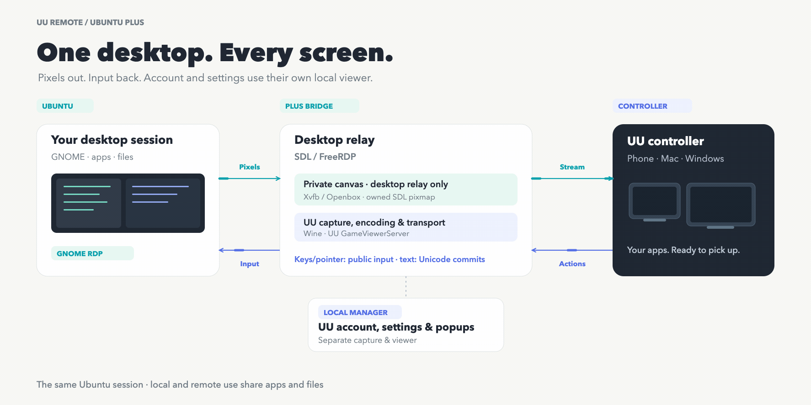
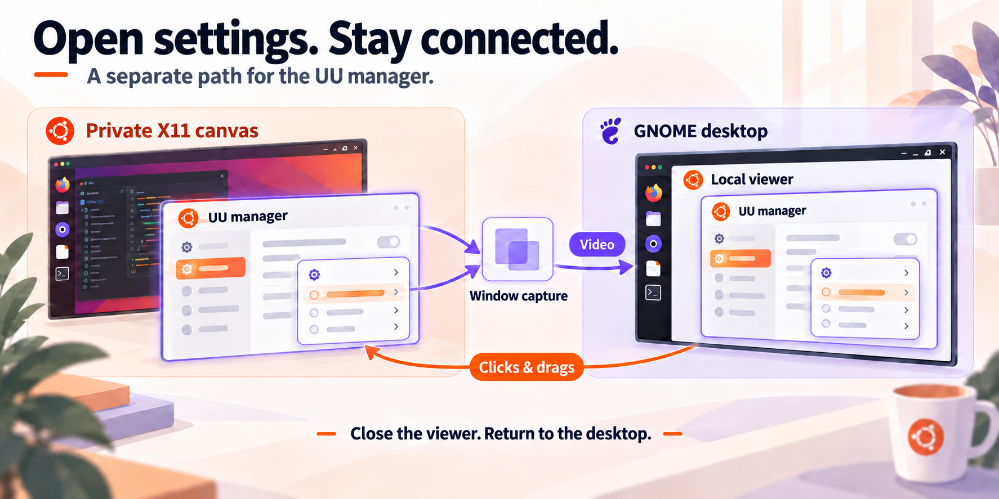

[English](../../architecture.md) · [العربية](../ar/architecture.md) · [Español](../es/architecture.md) · [Français](../fr/architecture.md) · [日本語](../ja/architecture.md) · [한국어](../ko/architecture.md) · [Tiếng Việt](../vi/architecture.md) · [中文（简体）](../zh-Hans/architecture.md) · [中文（繁體）](../zh-Hant/architecture.md) · [Deutsch](../de/architecture.md) · [Русский](../ru/architecture.md)

[← На главную на русском](../../../i18n/README.ru.md)

# Архитектура

## Два рабочих стола и два направления

Официальное приложение UU для Windows работает в отдельном префиксе Wine. Его драйвер ядра не управляет GNOME напрямую. Мост предоставляет окно ретранслятора на частном дисплее X11: изображение идёт из Ubuntu к контроллеру UU, а клавиатура, мышь и подтверждённый текст — обратно. Локальное окно управления образует отдельную ветвь. Используются манифест UU 4.42 и закреплённая сборка FreeRDP/SDL.

Новая установка выбирает `rdp`, ввод `rdp-public`, цель `auto`, 1920 × 1080, следование разрешению `off` и текст телефона `auto`. Обновление сохраняет настройки. Без установленной конфигурации маршрута запуск использует `legacy`. Четыре обычных размера: 720p, 1080p, 1440p и 4K. VNC включается явно для X11/XRDP с `legacy` и не заменяет сеанс Wayland.

## Изображение и обычный ввод

GNOME Remote Desktop запускается на D-Bus выбранного сеанса. FreeRDP подключается по loopback, обычно `127.0.0.1:3390`, проверяет отпечаток TLS и получает пароль через stdin. Xvfb использует Xauthority и `-nolisten tcp`. В `rdp-public` XComposite помещает только связанное окно SDL на частный root; UU захватывает, кодирует и передаёт изображение.

Проверенный патч конкретной версии выбирает существующий `SendInput`. Публичный broker отправляет события в локальный pipe `uurb-full-input`, затем функции FreeRDP доставляют их по уже существующему RDP. `/dvc:uurb-full-input` загружает плагин, но нового серверного канала ввода не требуется. `legacy` сначала пробует Wine для обычных событий, затем передаёт непринятый остаток broker. Прямой XTEST доступен дополнительно на X11; неоднозначно доставленные события не повторяются.

## Текст и буфер обмена

Физические клавиши и `KEYEVENTF_UNICODE` разделены. `rdp-public/auto` сохраняет буквальный текст всех Unicode-коммитов, включая ASCII. `legacy/auto` преобразует представимый текст в сочетания клавиш, а китайский, табуляцию и переводы строк вставляет семантически. Помощник владеет `CLIPBOARD` и `PRIMARY`, проверяет новых владельцев и отправляет `Shift+Insert` по выбранному пути. Барьер подтверждает транзакцию выделения; приложение всё равно должно иметь фокус и поддерживать вставку. Обычное копирование использует `cliprdr`. Помощник VNC передаёт только текст GameViewer в Ubuntu, без обратного чтения или клавиши вставки.

## Управление и жизненный цикл

`uu-remote open` захватывает окно управления и связанные всплывающие окна через XComposite в локальный TigerVNC. Ввод возвращается соответствующему собственному окну. Закрытие завершает вспомогательные процессы и возвращает фокус ретранслятору; окно UU остаётся mapped. Эта ветвь не является промежуточным звеном потока рабочего стола.

Качество меняет частный холст, не физический монитор. Восстановление готовится до изменения; его сбой сообщается. Пользовательский сервис наблюдает за своими дочерними процессами и очищает только свой префикс. GNOME обеспечивает ввод Wayland; адаптер вызывает FreeRDP, не libei напрямую. Старый backport libei необязателен, Ubuntu 26.04 уже содержит системную правку. Терминал и автоматический вход имеют отдельные пути.

[Качество](quality-guide.md) · [Сборка](source-build.md) · [Безопасность](security.md)




[PNG](../../images/uu-plus-data-paths-en.png) · [SVG](../../images/uu-plus-data-paths-en.svg)



## Команды и технические значения

```text
GNOME -> GNOME Remote Desktop -> loopback RDP -> SDL FreeRDP
  -> private X11 / UU capture -> UU controller
UU controller -> SendInput hook -> broker -> uurb-full-input
  -> FreeRDP input -> GNOME Remote Desktop -> GNOME
GameViewer + popups -> XComposite -> loopback x11vnc -> local TigerVNC
```

## Исходный код и связанные темы

- [install.sh](../../../install.sh#L358)
- [scripts/uu-remote-bridge](../../../scripts/uu-remote-bridge#L6)
- [scripts/runtime-settings.sh](../../../scripts/runtime-settings.sh)
- [scripts/uu-remote-bridge](../../../scripts/uu-remote-bridge#L1010)
- [scripts/uu-remote-bridge](../../../scripts/uu-remote-bridge#L1758)
- [scripts/uu-remote-bridge](../../../scripts/uu-remote-bridge#L1437)
- [scripts/uu-manual-plane.py](../../../scripts/uu-manual-plane.py#L155)
- [scripts/uu-remote-bridge](../../../scripts/uu-remote-bridge#L1040)
- [scripts/uu-remote-bridge](../../../scripts/uu-remote-bridge#L1844)
- [patches/uu-remote-4.42.0.2770.json](../../../patches/uu-remote-4.42.0.2770.json)
- [src/uu_input_bridge.c](../../../src/uu_input_bridge.c#L688)
- [src/uu_input_broker.c](../../../src/uu_input_broker.c#L1081)
- [src/plugin.c](../../../src/plugin.c#L200)
- [src/freerdp-adapter.c](../../../src/freerdp-adapter.c#L48)
- [src/uu_input_bridge_legacy.c](../../../src/uu_input_bridge_legacy.c#L595)
- [src/uu_input_broker.c](../../../src/uu_input_broker.c#L1101)
- [src/uu_input_broker.c](../../../src/uu_input_broker.c#L454)
- [src/uu_input_broker.c](../../../src/uu_input_broker.c#L641)
- [scripts/uu-remote-bridge](../../../scripts/uu-remote-bridge#L1182)
- [src/uu_x11_input.c](../../../src/uu_x11_input.c#L1000)
- [scripts/uu-remote-bridge](../../../scripts/uu-remote-bridge#L1266)
- [src/uu_wine_clipboard_bridge.c](../../../src/uu_wine_clipboard_bridge.c#L195)
- [src/uu_x11_clipboard.c](../../../src/uu_x11_clipboard.c#L329)
- [scripts/uu-remote-console](../../../scripts/uu-remote-console#L1121)
- [src/uu_manager_capture.c](../../../src/uu_manager_capture.c#L464)
- [src/uu_manager_capture.c](../../../src/uu_manager_capture.c#L1090)
- [scripts/uu-remote-console](../../../scripts/uu-remote-console#L1193)
- [scripts/uu-remote-console](../../../scripts/uu-remote-console#L622)
- [scripts/uu-remote-console](../../../scripts/uu-remote-console#L299)
- [scripts/uu-quality.py](../../../scripts/uu-quality.py#L329)
- [scripts/uu-display-modes.py](../../../scripts/uu-display-modes.py#L166)
- [scripts/uu-remote-bridge](../../../scripts/uu-remote-bridge#L199)
- [scripts/uu-remote-bridge](../../../scripts/uu-remote-bridge#L1121)
- [scripts/uu-remote-bridge](../../../scripts/uu-remote-bridge#L2207)
- [scripts/uu-remote-bridge](../../../scripts/uu-remote-bridge#L478)
- [systemd/uu-remote-bridge.service](../../../systemd/uu-remote-bridge.service)

Подробные технические страницы доступны на английском и упрощённом китайском:

- [native-ubuntu-terminal](../../native-ubuntu-terminal.md) · [简体中文](../zh-Hans/native-ubuntu-terminal.md)
- [unattended-startup](../../unattended-startup.md) · [简体中文](../zh-Hans/unattended-startup.md)
- [semantic-text-and-clipboard](../../semantic-text-and-clipboard.md) · [简体中文](../zh-Hans/semantic-text-and-clipboard.md)
