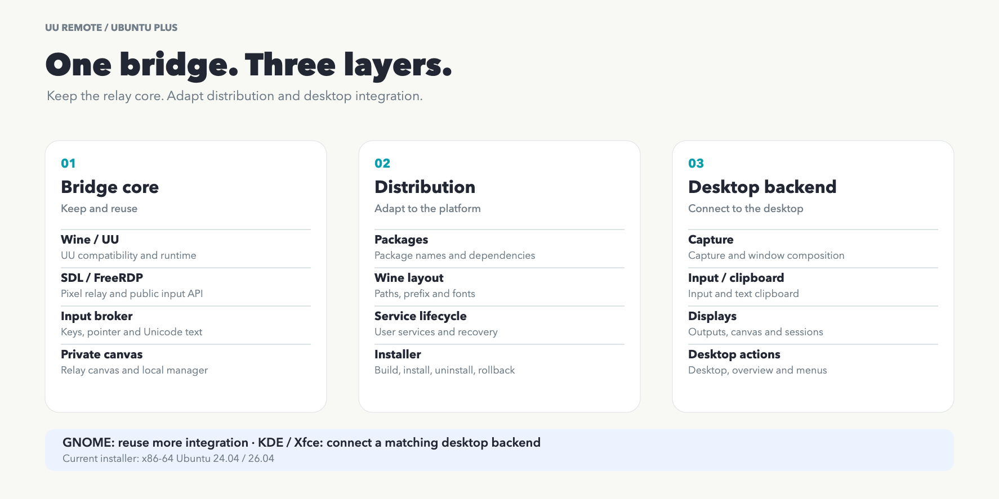

[English](../../porting.md) · [العربية](../ar/porting.md) · [Deutsch](../de/porting.md) · [Español](../es/porting.md) · [Français](../fr/porting.md) · [日本語](../ja/porting.md) · [한국어](../ko/porting.md) · [Русский](../ru/porting.md) · [Tiếng Việt](../vi/porting.md) · [简体中文](../zh-Hans/porting.md) · [繁體中文](../zh-Hant/porting.md)

[Главная](../../../i18n/README.ru.md)

# Перенос на другие Linux-десктопы

x86-64 GNOME ближе всего: можно сохранить RDP, адаптируя установку. KDE/Xfce нужны собственные адаптеры. Сейчас установщик рассчитан на Ubuntu 24.04/26.04, остальные — цели переноса.

Для установки реле нужна точная проверенная цепочка инструментов или уже проверенный результат; обычные APT-пакеты не предоставляют эту цепочку автоматически. См. [условия сборки и использование кэша](source-build.md).

[Редактируемый SVG](../../images/uu-plus-porting.svg)

| Слой | Повторное использование | Работа / источники |
| --- | --- | --- |
| Ядро |Wine/UU, манифест, SDL/FreeRDP, брокер/плагин, холст/менеджер|Границы протокола, Unicode отдельно; [брокер](../../../src/uu_input_broker.c), [RDP](../../../src/freerdp-adapter.c), [плагин](../../../src/plugin.c), [захват](../../../src/uu_manager_capture.c)|
| Дистрибутив |Рецепт, проверки, конфигурация/служба|Пакеты/пути/библиотеки/запуск; [установка](../../../install.sh), [сборка](../../../scripts/build-winpr.sh), [проверки](../../../scripts/verify-freerdp-runtime.py), [служба](../../../systemd/uu-remote-bridge.service)|
| Десктоп |RDP-события, текст/действия|Сессия/захват/ввод/буфер/геометрия/действия; [запуск](../../../scripts/uu-remote-bridge), [текст](../../../src/uu_x11_input.c), [режимы](../../../scripts/uu-display-modes.py)|

Публичные FreeRDP API используют готовое соединение; сервер можно менять независимо от Windows hook UU. Unicode требует буфера источника/вставки, сейчас X11/Xwayland. Менеджер остаётся в частном Wine X11. [Архитектура](architecture.md).

| Платформа | Повторное использование и адаптация |
| --- | --- |
| Ubuntu 24.04/GNOME 46 |Готовый установщик/backend, libei backport|
| Ubuntu 26.04/GNOME 50 |Plus, системный libei, UU 4.42|
| Debian/GNOME |Ядро/холст/RDP; Debian-пакеты/Wine, preflight/daemon/библиотеки; [APT/dpkg](https://www.debian.org/doc/manuals/debian-reference/ch02.en.html)|
| Fedora/GNOME |Ядро/backend; RPM/DNF/пути/права; [GRD](https://packages.fedoraproject.org/pkgs/gnome-remote-desktop/gnome-remote-desktop/)|
| Arch/GNOME |Ядро/backend; pacman/пути/инструменты/обновленияGNOME/libei; [GRD](https://archlinux.org/packages/extra/x86_64/gnome-remote-desktop/)|
| KDE |Ядро/холст/менеджер; сессия/захват/ввод/выходы/буфер/действия; [KRDP](https://github.com/KDE/krdp) требует интеграции авторизации/кодека/текста|
| Xfce/X11 |Ядро/холст/менеджер/X11; сессия/геометрия/действия, VNC `legacy` как начало|

Замена менеджера пакетов решает лишь установку. Нужны захват, ввод, геометрия источника и действия.

| Интерфейс | Текущий вариант / перенос |
| --- | --- |
| Архитектура |`x86_64`, AMD64 PE; другой хост требует выполнения AMD64/проверок|
| Пакеты |Ubuntu, `apt-get`, `dpkg`, i386, WineHQ; заменить картой целевых пакетов|
| Wine |`/opt/wine-stable/bin/wine`, `wineserver`, `winepath`; единые пути запуска/очистки|
| Сборка |MinGW/CMake/Meson/Ninja/архивы фиксированы; совпадение или новый профиль; [руководство](source-build.md)|
| Сессия |`gnome-shell`, D-Bus, `/usr/libexec/gnome-remote-desktop-daemon`; найти/заменить|
| Доступ |Keyring, `secret-tool`, `grdctl`, `org.gnome.desktop.remote-desktop.rdp`; TLS/служба отдельно от UU|
| Выходы |`org.gnome.Mutter.DisplayConfig`, виртуальный монитор; API композитора, XRandR в X11|
| Текст |`uu-x11-input`/`xclip`, `CLIPBOARD`/`PRIMARY`; верный display, Wayland API|
| Действия |`_NET_SHOWING_DESKTOP`, `org.gnome.Shell.OverviewActive`; целевой WM/состояние|
| Служба |`systemctl --user`, графический D-Bus; адаптировать session/init|
| Утилиты |`/usr/bin/xfreerdp`, `xtigervncviewer`, `obconf`, `zenity`; пути/шрифты/DPI/интерактивный вход/защита реле|

Частный Wine/Xvfb-холст отделён от физических/виртуальных выходов. Сохраните четыре режима, заменив Mutter-логику на KDE/Xfce.

1. Выберите один x86-64 дистрибутив/сессию, запишите OS/desktop/Wine/UU.
2. Адаптируйте пакеты/пути/библиотеки/службу/ярлыки, проверьте реле.
3. Свяжите захват/ввод, bus/display, доступ, геометрию/буфер.
4. Реальный контроллер: движение/клики/колесо/drag, сочетания, Unicode/вставка/переподключение, менеджер/popups.
5. Четыре режима, восстановление, откат, очистка и действия.

Передавайте карты/пути/версии/результаты без UU-бинарников/аккаунтов. [Сравнение](upstream-comparison.md), [качество](quality-guide.md).
