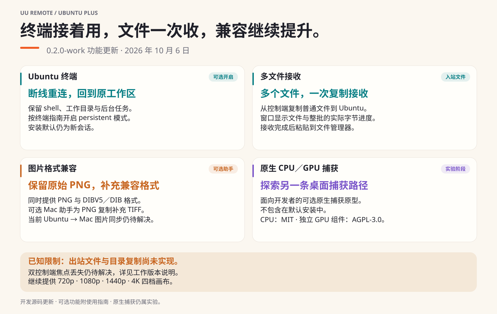

[English](../../../updates/2026-10-06.md) · [中文（简体）](2026-10-06.md)

[← 返回简体中文首页](../../../../i18n/README.zh-Hans.md)

# 0.2.0-work 更新了什么

这个开发版本让通过 UU 使用 Ubuntu 的工作更连贯。Plus 0.1.0 仍是最近的标签版本。

[可编辑 SVG](../../../images/uu-plus-update-20261006-zh-Hans.svg)

- **终端接着用：**可选 `persistent` 模式在重连后保留 shell、工作目录与任务，安装默认仍为新会话。[开启会话保留](../native-ubuntu-terminal.md#断线后保留终端可选)。
- **多个文件一次收：**在控制端复制普通文件，窗口显示文件与整批的实际字节进度；接收完成后粘贴到 Ubuntu 文件管理器。[文件接收说明](../../../releases/plus-v0.2.0-work.md#incoming-multi-file-copy)。
- **图片格式兼容：**原始 PNG 与 DIBV5／DIB 一起保留，可选 Mac 助手为 PNG 复制补充 TIFF。[Mac 助手](../../../macos-clipboard-compat.md)。
- **原生捕获探索：**可选 CPU／GPU 原型探索另一条捕获路径，目前仍属实验，不包含在默认安装。[开发指南](../../../native-video-backends.md)。

已知限制：出站文件与目录复制未实现；当前 Ubuntu → Mac 图片同步与双控制端焦点仍待解决。[详细限制与验证范围](../../../releases/plus-v0.2.0-work.md) · [更新记录](../../../../i18n/CHANGELOG.zh-Hans.md)

## 可复用的发布文案

以下文字已准备好；本次更新未将其发布到外部平台。

> UU Remote Ubuntu Plus 0.2.0-work 增加可选终端会话保留，断线重连后继续原工作区；多文件接收支持实际字节进度；图片处理保留原始 PNG，并提供可选 Mac 兼容助手。同时加入面向开发者的 CPU／GPU 原生捕获实验，使用指南和中英文配图同步更新。文件接收仅支持入站；当前 Ubuntu → Mac 图片同步与切换控制端的焦点仍待解决。这是开发源码更新，不创建新的发布标签。
