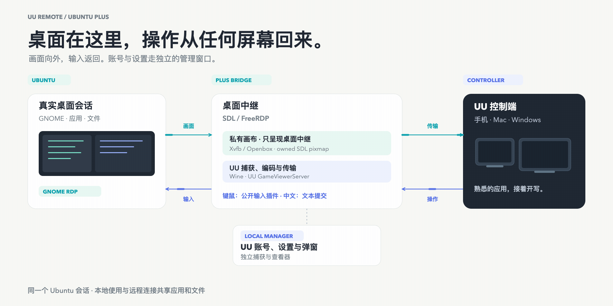

[English](../../architecture.md) · [العربية](../ar/architecture.md) · [Español](../es/architecture.md) · [Français](../fr/architecture.md) · [日本語](../ja/architecture.md) · [한국어](../ko/architecture.md) · [Tiếng Việt](../vi/architecture.md) · [中文（简体）](../zh-Hans/architecture.md) · [中文（繁體）](../zh-Hant/architecture.md) · [Deutsch](../de/architecture.md) · [Русский](../ru/architecture.md)

[← 返回繁體中文首頁](../../../i18n/README.zh-Hant.md)

# 架構


紫色箭頭把 Ubuntu 的畫面送往控制端，橙色箭頭把鍵盤、滑鼠和文字送回 Ubuntu。底部管理分支在本機顯示 UU 自己的視窗，操作返回這些視窗。RDP 服務、輸入外掛和文字輔助路徑見下文。

## 兩個桌面，兩個方向

UU 的 Windows 主機端執行在獨立 Wine 字首中，Windows 核心輸入驅動不能直接控制原生 GNOME。橋接器在私有 X11 顯示中提供桌面中繼視窗，把 UU 的使用者態輸入送入選定的 Ubuntu 會話。

已登入的真實桌面與 Wine 畫布相互獨立。畫面從 Ubuntu 經中繼傳到手機、Mac 或 Windows 控制端；鍵鼠和已提交的文字沿反方向返回。管理檢視器只是 UU 賬戶與設定的本機視窗，不串聯在遠端桌面流中。當前源採用 UU 4.42 清單和固定來源的 FreeRDP/SDL 構建；更新保留原有配置。

## 預設設定與可選分支

| 設定 | 新安裝預設 | 可選配置 |
| --- | --- | --- |
| 桌面中繼 | `rdp` | X11/XRDP 桌面可顯式選擇 `vnc` |
| 輸入路徑 | RDP 對應 `rdp-public` | `legacy`；VNC 必須使用它 |
| 目標桌面 | `auto` | `physical`、`xrdp` 或準確的 X display |
| 私有畫布 | 1920 × 1080 | 四檔 720p、1080p、1440p、4K |
| 跟隨桌面解析度 | `off` | 顯式開啟 `on` |
| 舊輸入分支的物理鍵路由 | 經中繼的 `rdp` | X11 上的 `x11` 或 `auto` |
| 手機文字 | `auto` | `keys` 或 `clipboard` |

[安裝器](../../../install.sh#L358)負責新安裝預設值。沒有已安裝輸入配置而直接呼叫[啟動器](../../../scripts/uu-remote-bridge#L6)時，回退值是 `legacy`。`rdp-public` 要求 RDP 中繼；VNC 要求可訪問的 X11/XRDP 桌面，不能代替 Wayland。

[runtime-settings.sh](../../../scripts/runtime-settings.sh)區分新安裝與升級時的手機按鍵節奏。中繼選擇不改變控制端的編碼質量、FPS 或位元速率上限。

## 畫面：Ubuntu 到控制端



[靜態 PNG](../../images/uu-plus-data-paths-zh-Hans.png) · [可編輯 SVG](../../images/uu-plus-data-paths-zh-Hans.svg) · [英文動圖](../../images/uu-plus-data-flow-en.gif)

```text
已登入並選定的 GNOME 桌面
  → 對應會話 D-Bus 上的 GNOME Remote Desktop
  → 本機迴環 RDP
  → 固定原始碼構建的 Windows SDL FreeRDP：Ubuntu-Desktop-Relay
  → 私有 X11 畫布（rdp-public 只合成繫結的 SDL 視窗）
  → UU GameViewerServer 捕獲、編碼和傳輸
  → 手機、macOS 或 Windows UU 控制端
```

啟動器發現 GNOME Shell 的 display、會話和 D-Bus；顯式指定目標時等待該目標，不替換成其他會話。GNOME RDP 在選定總線上啟動，包括 XRDP 的私有匯流排。FreeRDP 預設連線 `127.0.0.1:3390`，固定 TLS 證書指紋，從標準輸入讀取 GNOME 憑據。這不是 UU 賬戶密碼。原始碼見[桌面中繼](../../../scripts/uu-remote-bridge#L1010)和[SDL 啟動](../../../scripts/uu-remote-bridge#L1758)。

Xvfb 與 Openbox 提供私有畫布。Xvfb 使用 Xauthority 和 `-nolisten tcp`，從 `:20` 開始選擇空閒 display，或使用經過檢查的指定 display。標準 RDP 模式最高 4K，在 Wine 啟動前註冊四個真真實模式，見[顯示配置](../../../scripts/uu-remote-bridge#L1437)。

`rdp-public` 下，[uu-manual-plane.py](../../../scripts/uu-manual-plane.py#L155)擁有 XComposite 重定向，只將繫結 SDL 的 pixmap 繪製到私有 root。管理視窗保持 mapped，但不進入這張 root 影像。

可選 VNC 分支為：

```text
選定的 X11 桌面 → 迴環 x11vnc → 私有全屏 VNC 檢視器
  → UU 捕獲和傳輸 → UU 控制端
```

它使用已獨立管理且經過檢查的迴環 x11vnc，或由橋接器啟動自己的服務。檢視器適配桌面畫面，不改變物理顯示器。該分支使用 `legacy` 輸入，見[VNC 服務](../../../scripts/uu-remote-bridge#L1040)和[檢視器](../../../scripts/uu-remote-bridge#L1844)。

## 普通輸入：控制端到 Ubuntu

經過審閱、按版本匹配的 UU 補丁選擇已有使用者態 `SendInput`，替代 Windows 核心 HID 驅動。[4.42 清單](../../../patches/uu-remote-4.42.0.2770.json)只對應該版本。

```text
控制端鍵盤、指標、按鈕和滾輪
  → GameViewerServer 的 SendInput 匯入鉤子
  → 本機 broker 命名管道
  → uu-input-broker.exe / uurb_rdp_backend
  → SDL 內 uurb-full-input 的本機命名管道
  → FreeRDP 公共鍵鼠介面
  → 既有 RDP 連線 → GNOME Remote Desktop → 選定桌面
```

`/dvc:uurb-full-input` 載入外掛，但 broker 與外掛間使用本機命名管道，不要求新增伺服器輸入通道。後端繫結會話和幾何尺寸，外掛在 FreeRDP 事件迴圈定時器上派發。此路徑不靠搶 Wine 視窗焦點，也不會在部分或不明確的投遞之後回退重放。原始碼：[輸入鉤子](../../../src/uu_input_bridge.c#L688)、[broker](../../../src/uu_input_broker.c#L1081)、[外掛](../../../src/plugin.c#L200)、[介面卡](../../../src/freerdp-adapter.c#L48)。

`legacy` 對普通陣列先嚐試 Wine `SendInput`，將未接收的餘項交給 broker；Unicode 直接交給 broker。broker 聚焦私有中繼，再透過 RDP/VNC 到達 Ubuntu。X11 桌面可選 `--keyboard-route x11` 或 `auto`，經帶認證的原生 XTEST 輔助程式注入。注入前輔助程式不可用時可保留中繼路徑；注入後的不明確失敗不會重放。見[舊鉤子](../../../src/uu_input_bridge_legacy.c#L595)及[路由選擇](../../../src/uu_input_broker.c#L1101)。

## Unicode 文字與複製貼上

物理鍵與 IME 已提交文字不是同一種輸入。手機 IME 提供 `KEYEVENTF_UNICODE`。`legacy/auto` 將鍵盤佈局可表達的文字轉成按鍵組合；中文、換行、製表符等使用原生文字輔助程式。`rdp-public/auto` 對所有 Unicode 提交採用字面文字，包括 ASCII，避免 Caps Lock 或佈局改寫內容。顯式 `keys` 模式選擇按鍵翻譯，見[文字選擇](../../../src/uu_input_broker.c#L454)。

語義文字協調兩件事：

1. broker 透過認證迴環連線傳送有上限的文字。`uu-x11-input` 轉為 UTF-8，由 `xclip` 在目標 X11/Xwayland 上擁有 `CLIPBOARD` 和 `PRIMARY`，並核實新 owner。
2. `rdp-public` 經外掛/RDP 傳送 `Shift+Insert`，再檢查 owner/selection-request 屏障。舊 RDP 分離路徑在源桌面設定選區，只在私有 SDL display 發貼上組合鍵；直接 X11 在目標 display 完成兩步。

屏障確認有限的選區事務；應用仍須支援貼上並擁有焦點。見[send_semantic_segment](../../../src/uu_input_broker.c#L641)、[display 選擇](../../../scripts/uu-remote-bridge#L1182)、[選區事務](../../../src/uu_x11_input.c#L1000)及[文字和剪貼簿（英文／簡體中文）](../zh-Hans/semantic-text-and-clipboard.md)。

普通複製貼上使用 RDP 的 `cliprdr`，與手機 IME 獨立。固定 FreeRDP/SDL 補丁處理遠端快取及 sequence/owner，構建方式見[原始碼構建](source-build.md)。VNC 另有單向文字輔助路徑：

```text
控制端 UU 剪貼簿 → GameViewer CF_UNICODETEXT
  → uu-wine-clipboard-bridge → 認證迴環輔助程式
  → 目標桌面 CLIPBOARD 和 PRIMARY
```

它以啟動 sequence 為基線，讀取前後都要求 owner 為 GameViewer；不讀取主機剪貼簿回傳，也不發貼上鍵，只在顯式 VNC/X11 分支啟動。見[啟動](../../../scripts/uu-remote-bridge#L1266)、[owner 檢查](../../../src/uu_wine_clipboard_bridge.c#L195)、[原生 owner](../../../src/uu_x11_clipboard.c#L329)。

## 本機管理與控制視窗


`uu-remote open` 透過本機 TigerVNC 顯示 GameViewer 管理介面。Wine 視窗仍在專用字首和私有 display 中。

```text
管理視窗及同 owner 的彈窗/模態視窗
  → XComposite pixmap / uu-manager-capture.so
  → 限定視窗的迴環 x11vnc → 本機 TigerVNC
本機檢視器鍵鼠 → x11vnc → owner 命中與焦點處理 → 對應 UU 視窗
```

輔助程式合成關聯彈窗、重新核實 owner 與幾何尺寸。override-redirect 選單保留焦點/grab，管理視窗內移動指標不會持續搶焦。見[捕獲繫結](../../../scripts/uu-remote-console#L1121)、[彈窗關聯](../../../src/uu_manager_capture.c#L464)、[輸入路由](../../../src/uu_manager_capture.c#L1090)。

`rdp-public` 由合成 owner 將管理視窗排除 root；`legacy` 只重定向自己管理的幀，中繼監督繼續執行。檢視器關閉剪貼簿交換和遠端改尺寸。session lock 複用已有檢視器；關閉後回收 sidecar、移除 session、釋放管理焦點標記並恢復中繼焦點。UU 視窗保持 mapped，不在 layered-window 替換期間最小化。見[檢視器選項](../../../scripts/uu-remote-console#L1193)、[清理](../../../scripts/uu-remote-console#L622)、[焦點釋放](../../../scripts/uu-remote-console#L299)。

Ubuntu 控制其他機器時，獨立繫結的控制視窗可使用相同捕獲方式，屬於另一條 UU 控制會話。全 root noVNC 是顯式診斷入口，不是常規管理視窗。

## 解析度、相容性與生命週期

畫布控制改變私有中繼，不改變物理顯示器。質量選擇器保留四檔，檢查儲存值與實際畫布，在變更前安排獨立恢復。試用失敗時恢復配置並按需重啟；恢復無法確認時報告失敗。固定畫布要求關閉解析度跟隨。見[恢復](../../../scripts/uu-quality.py#L329)、[模式註冊](../../../scripts/uu-display-modes.py#L166)和[畫質指南](quality-guide.md)。

GNOME Remote Desktop 負責 GNOME 整合。Wayland 輸入由其系統合成器路徑承擔；本專案介面卡呼叫 FreeRDP，不直接呼叫 libei。可配置的舊版 libei keymap-FD 補丁僅作用於受監督的 GNOME RDP 子程序；26.04 已含系統修復，不替換系統庫。見[補丁選擇](../../../scripts/uu-remote-bridge#L199)、[GNOME 環境](../../../scripts/uu-remote-bridge#L1121)。

SDL 來自固定原始碼。`winpr-sspi-shim.dll` 轉發 SSPI 並規範 Wine/WinPR 私有控制代碼以完成認證；UU 輔助程式補齊活動會話 token 來源與事件日誌 API 失敗形態，不增加 Unix 許可權。

systemd 使用者服務擁有程序組。關鍵子程序退出會觸發整體中繼重啟；內部監督在 UU 重啟後重新繫結輸入鉤子。清理僅停止自有輔助程式和專用字首 Wine 程序，回收選區 owner、捕獲和 session 標記，恢復之前活動的原生 GNOME 分享服務；不清理其他 Wine 字首或桌面應用。見[子程序監督](../../../scripts/uu-remote-bridge#L2207)、[清理](../../../scripts/uu-remote-bridge#L478)、[使用者 unit](../../../systemd/uu-remote-bridge.service)。

無活動顯示器的 Wayland 會話可臨時使用 GNOME 虛擬顯示器；物理顯示器返回或橋接停止後恢復分享模式。終端通道則由 Windows stdio 代理和認證迴環 `forkpty` 輔助程式運行當前使用者登入 shell，不依賴 SSH listener。見[原生終端（英文／簡體中文）](../zh-Hans/native-ubuntu-terminal.md)和[無人值守啟動（英文／簡體中文）](../zh-Hans/unattended-startup.md)。
