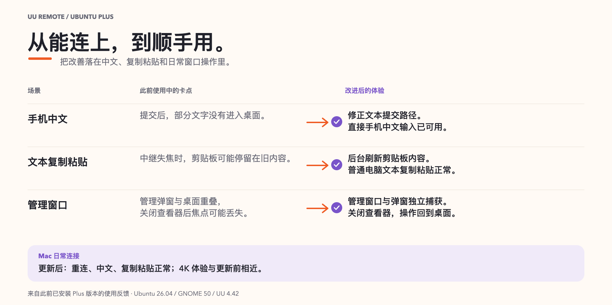
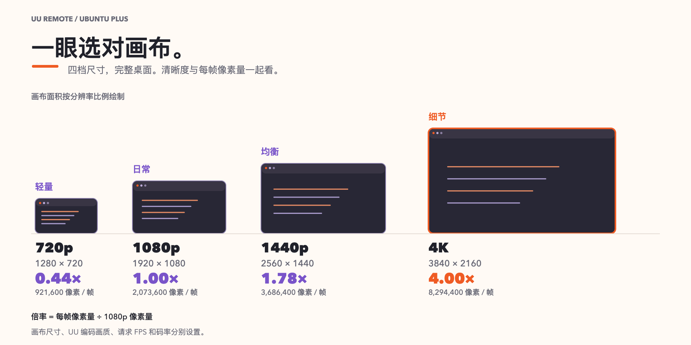
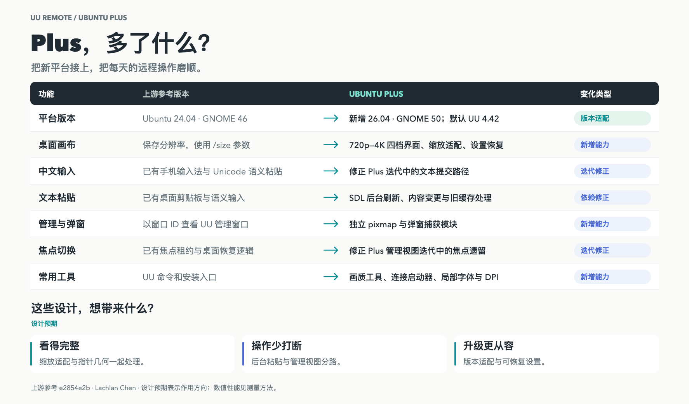

[English](../../performance-evidence.md) · [العربية](../ar/performance-evidence.md) · [Deutsch](../de/performance-evidence.md) · [Español](../es/performance-evidence.md) · [Français](../fr/performance-evidence.md) · [日本語](../ja/performance-evidence.md) · [한국어](../ko/performance-evidence.md) · [Русский](../ru/performance-evidence.md) · [Tiếng Việt](../vi/performance-evidence.md) · [简体中文](../zh-Hans/performance-evidence.md) · [繁體中文](../zh-Hant/performance-evidence.md)

[首頁](../../../i18n/README.zh-Hant.md)

# 體驗與效能

[可編輯 SVG](../../images/experience-refinements-zh-Hans.svg)

[可編輯 SVG](../../images/canvas-pixel-scale-zh-Hans.svg)

依螢幕／連線選720p/1080p/1440p/4K；畫質、要求FPS、位元率獨立。

## 日常改善

更新重點落在中文輸入、文字貼上和視窗操作。

| 情境 | 使用背景 | 此前體驗 | 改進後的體驗 |
| --- | --- | --- | --- |
| 手機中文 | 此前 Plus 手機輸入 | 手機提交的部分文字未正確到達桌面 | 手機直連提交的中文能正確輸入 Ubuntu 桌面 |
| 複製貼上 | 此前 Plus 文字中繼 | 複製新內容後，貼上有時仍是舊文字 | 新複製的文字及時更新到桌面貼上，一般電腦文字複製貼上正常 |
| UU 設定／彈窗 | 此前 Plus 管理檢視 | 管理視窗可能覆蓋桌面畫面，返回後焦點不對 | 設定視窗與桌面畫面分開，關閉管理檢視後操作焦點回到桌面 |
| 清晰度／畫布 | Plus 畫布擴展試驗 | 4K 來源繼續放大沒有增加細節，反而較模糊 | 四檔完整顯示桌面，並可恢復已儲存尺寸；測試來源用到 4K 即可 |
| 重連 | Mac UU 用戶端更新 | Mac UU 更新後需要檢查日常桌面操作 | 更新後一般重連、直連中文輸入與文字貼上保持正常，4K 體驗相近 |

[比較頁](upstream-comparison.md)區分上游基礎、新版本相容、Plus 新增功能與 Plus 使用期間的修正。

[可編輯 SVG](../../images/uu-plus-evolution-zh-Hans.svg)

**設計預期：**文字及時更新、操作焦點穩定返回，可減少重複貼上和設定／桌面切換時的中斷。較小畫布每影格提供的像素更少；實際回應還受擷取、編碼、網路和主控顯示影響。

| 畫布 | 每影格像素 | 相對1080p |
| --- | ---: | ---: |
| 1280 × 720 | 921,600 | 0.44× |
| 1920 × 1080 | 2,073,600 | 1.00× |
| 2560 × 1440 | 3,686,400 | 1.78× |
| 3840 × 2160 | 8,294,400 | 4.00× |

這是像素面積比。可能擷取完整來源，壓縮／運動／網路影響負載；縮放不改實體解析度。

| 設定 | 用途 |
| --- | --- |
| Ubuntu畫布 |中繼尺寸，從1080p起步，精細文字／空間用4K|
| 畫質/FPS/真彩 |壓縮、要求更新、支援色彩|
| `uu-remote quality bitrate 20` |20 Mbps上限，`0`解除，過低減少運動細節|

[畫質](quality-guide.md)提供選單／命令／恢復。

## 建置成本

完整冷來源建置，含準備和檢查：

| 項目 | 結果 |
| --- | --- |
| 耗時 |699.851秒，約11分40秒|
| 限制 |CPU雙核相當，記憶體4 GiB|
| 回報峰值 |約1.8 GB，服務管理器四捨五入讀數|
| Swap |0位元組|
| 輸出 |13 個Windows二進位|
| 重現性 |固定輸入在不同來源／輸出目錄有相同位元組|

正常入口規範路徑與明確設定。新機下載／編譯器影響時間；驗證輸出可重用。[建置](source-build.md)。

| 環境 | Ubuntu | GNOME | Windows UU |
| --- | --- | --- | --- |
| 上游 |24.04|46|4.33.0.8907|
| Plus本地 |26.04|50|4.42.0.2770|

## 同條件測量

現有紀錄沒有固定上游與 Plus 同條件的控制端 FPS 或輸入到可見畫面延遲測量。中繼計時與 CPU 配額實驗屬於元件測量。

固定主機／主控、來源解析度、應用、網路、畫質/FPS／位元率；獨立環境、固定版，考慮上游24.04邊界。從輸入動作到主控可見回應計時，在可重複運動畫面計算可見更新。重複、報波動／清晰度並保留方法。
