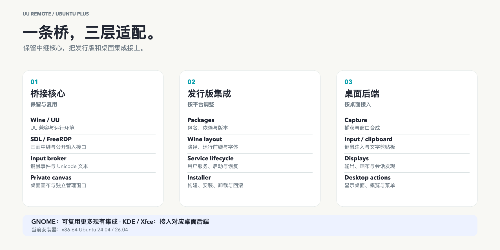

[English](../../porting.md) · [العربية](../ar/porting.md) · [Deutsch](../de/porting.md) · [Español](../es/porting.md) · [Français](../fr/porting.md) · [日本語](../ja/porting.md) · [한국어](../ko/porting.md) · [Русский](../ru/porting.md) · [Tiếng Việt](../vi/porting.md) · [简体中文](../zh-Hans/porting.md) · [繁體中文](../zh-Hant/porting.md)

[首頁](../../../i18n/README.zh-Hant.md)

# 遷移到其他 Linux 桌面

x86-64 GNOME 是最接近的起點，可保留 RDP 並調整安裝。KDE/Xfce 需要桌面適配。目前安裝器面向 Ubuntu 24.04／26.04，其他是遷移目標。

安裝中繼需要精確相符的已審核工具鏈，或已有驗證輸出／快取；一般 APT 套件不會自動提供這套工具鏈。見[建置前提與快取重用](source-build.md)。

[可編輯 SVG](../../images/uu-plus-porting-zh-Hans.svg)

| 層次 | 重用 | 調整／原始碼 |
| --- | --- | --- |
| 核心 |Wine/UU隔離、清單、SDL/FreeRDP、代理／插件、畫布／管理|維持邊界、Unicode／按鍵分開；[代理](../../../src/uu_input_broker.c)、[RDP](../../../src/freerdp-adapter.c)、[插件](../../../src/plugin.c)、[擷取](../../../src/uu_manager_capture.c)|
| 發行版 |配方／檢查／設定／服務|套件／路徑／庫／啟動器；[安裝](../../../install.sh)、[建置](../../../scripts/build-winpr.sh)、[檢查](../../../scripts/verify-freerdp-runtime.py)、[服務](../../../systemd/uu-remote-bridge.service)|
| 桌面 |RDP事件／文字／動作|會話／擷取輸入／剪貼簿／來源幾何／動作；[啟動](../../../scripts/uu-remote-bridge)、[文字](../../../src/uu_x11_input.c)、[模式](../../../scripts/uu-display-modes.py)|

FreeRDP 公開 API 使用已有連線，伺服器可獨立於 UU Windows 鉤子調整。Unicode 需要來源剪貼簿／貼上，目前 X11/Xwayland；管理視窗留在 Wine 私有 X11。[架構](architecture.md)。

| 平台 | 重用與主要工作 |
| --- | --- |
| Ubuntu 24.04/GNOME 46 |既有安裝器／後端、可選libei回移|
| Ubuntu 26.04/GNOME 50 |Plus、系統libei、UU 4.42|
| Debian/GNOME |核心／畫布／RDP；Debian套件／Wine、預檢／daemon／庫；[APT/dpkg](https://www.debian.org/doc/manuals/debian-reference/ch02.en.html)|
| Fedora/GNOME |核心／後端；RPM/DNF／路徑／權限；[GRD](https://packages.fedoraproject.org/pkgs/gnome-remote-desktop/gnome-remote-desktop/)|
| Arch/GNOME |核心／後端；pacman／路徑／固定工具／滾動更新；[GRD](https://archlinux.org/packages/extra/x86_64/gnome-remote-desktop/)|
| KDE |核心／畫布／管理；會話／擷取輸入／輸出／剪貼簿／動作；[KRDP](https://github.com/KDE/krdp)需認證／codec／文字整合|
| Xfce/X11 |核心／畫布／管理／X11；會話／來源幾何／動作；VNC `legacy`起點|

改套件管理器只處理安裝。來源擷取、輸入、幾何、桌面動作都須接通。

| 介面 | 目前實作與調整 |
| --- | --- |
| 架構 |`x86_64`、AMD64 PE；其他主機需AMD64執行／檢查|
| 套件 |Ubuntu、`apt-get`、`dpkg`、i386、WineHQ；目標映射|
| Wine |`/opt/wine-stable/bin/wine`、`wineserver`、`winepath`；啟動／清理一致|
| 建置 |MinGW/CMake/Meson/Ninja固定來源；相同或新設定審核；[指南](source-build.md)|
| 會話 |`gnome-shell`、D-Bus、`/usr/libexec/gnome-remote-desktop-daemon`；探索／替換|
| 憑證 |Keyring、`secret-tool`、`grdctl`、`org.gnome.desktop.remote-desktop.rdp`；TLS／服務獨立於UU|
| 輸出 |`org.gnome.Mutter.DisplayConfig`、虛擬螢幕；合成器／X11 XRandR|
| 文字 |`uu-x11-input`/`xclip`、`CLIPBOARD`/`PRIMARY`；正確顯示／原生Wayland介面|
| 動作 |`_NET_SHOWING_DESKTOP`、`org.gnome.Shell.OverviewActive`；目標視窗管理器／狀態|
| 服務 |`systemctl --user`、圖形D-Bus；目標會話／init|
| 工具 |`/usr/bin/xfreerdp`、`xtigervncviewer`、`obconf`、`zenity`；路徑／字型／DPI／互動憑證／中繼保護|

私有 Wine/Xvfb 畫布與實體／虛擬輸出不同；保留四檔，KDE/Xfce 替換 Mutter 來源邏輯。

1. 選一種x86-64系統／會話，記錄OS／桌面／Wine／UU。
2. 改套件／路徑／庫／服務／啟動器，驗證中繼。
3. 接通擷取輸入／bus／顯示／憑證／幾何／剪貼簿。
4. 真實主控檢查移動／點選／捲輪／拖曳／快捷鍵／Unicode／貼上／重連／管理彈窗。
5. 檢查四檔、儲存復原、失敗還原、程序清理、桌面／概覽。

貢獻映射／路徑／版本／結果，不帶UU執行檔或帳號。[比較](upstream-comparison.md)、[畫質](quality-guide.md)。
