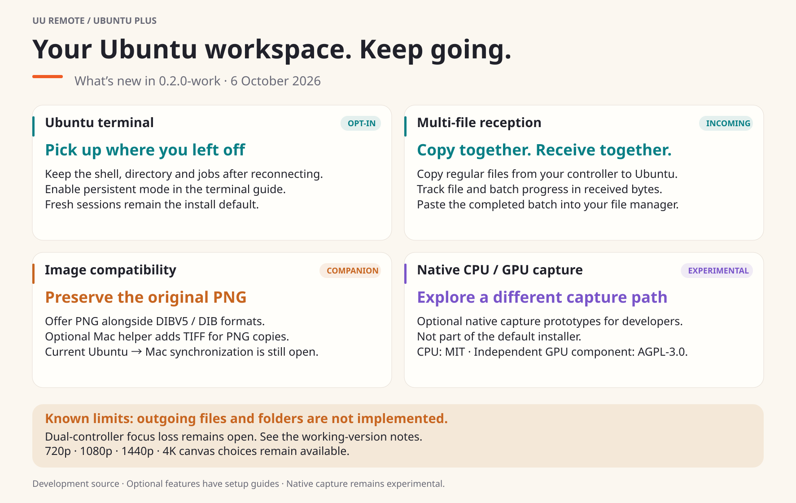

[English](2026-10-06.md) · [中文（简体）](../i18n/zh-Hans/updates/2026-10-06.md)

[← English home](../../README.md)

# What's new in 0.2.0-work

This development source adds new ways to keep working on Ubuntu through UU.
Plus 0.1.0 remains the last tagged release.

[Editable SVG](../images/uu-plus-update-20261006-en.svg)

- **Continue your terminal:** optional `persistent` mode keeps the shell,
  working directory and jobs across reconnects. Fresh sessions remain the
  default. [Enable persistence](../native-ubuntu-terminal.md#keep-the-terminal-across-reconnects-opt-in).
- **Receive multiple files:** copy regular files on the controller, follow
  actual file/batch byte progress, then paste the completed batch into the
  Ubuntu file manager. [File reception](../releases/plus-v0.2.0-work.md#incoming-multi-file-copy).
- **Improve image compatibility:** preserve original PNG alongside DIBV5/DIB;
  the optional Mac companion adds TIFF for PNG copies. [Mac companion](../macos-clipboard-compat.md).
- **Explore native capture:** optional CPU/GPU prototypes investigate another
  capture path. They remain experimental and are outside the default install.
  [Developer guide](../native-video-backends.md).

Known limits: outgoing files and directories are not implemented. Current
Ubuntu → Mac image synchronization and dual-controller focus remain open.
[Detailed limits and validation](../releases/plus-v0.2.0-work.md) · [Changelog](../../CHANGELOG.md)

## Reusable announcement

Prepared text; not posted to an external channel by this update.

> UU Remote Ubuntu Plus 0.2.0-work adds optional terminal persistence across
> reconnects, multi-file reception with byte progress, original PNG preservation
> and a Mac image compatibility companion. Optional CPU/GPU capture prototypes
> are also available for development experiments. Updated usage guides and
> bilingual illustrations cover the new features. File reception is incoming
> only; current Ubuntu → Mac image synchronization and controller-switching
> focus remain open. This is a development source update, with no new release tag.
