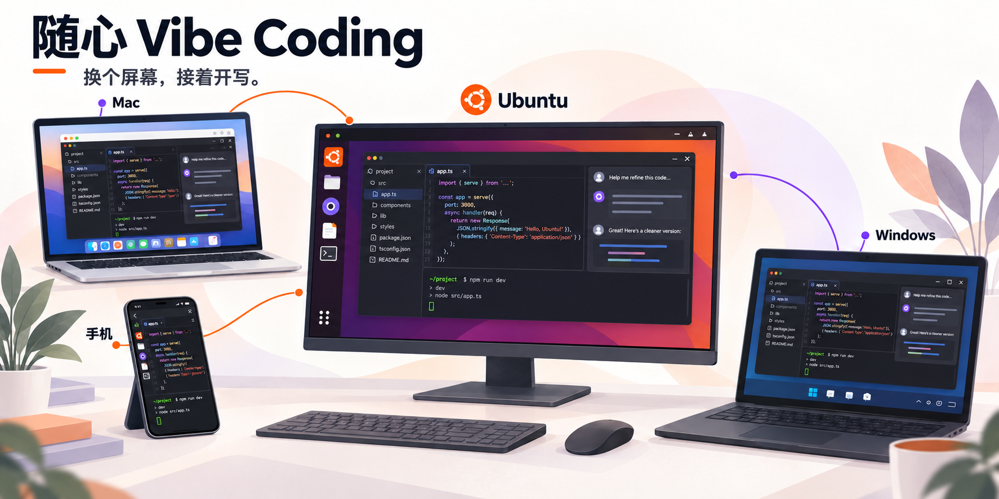
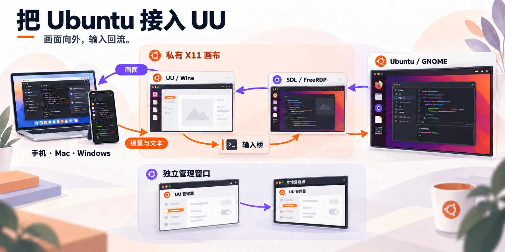
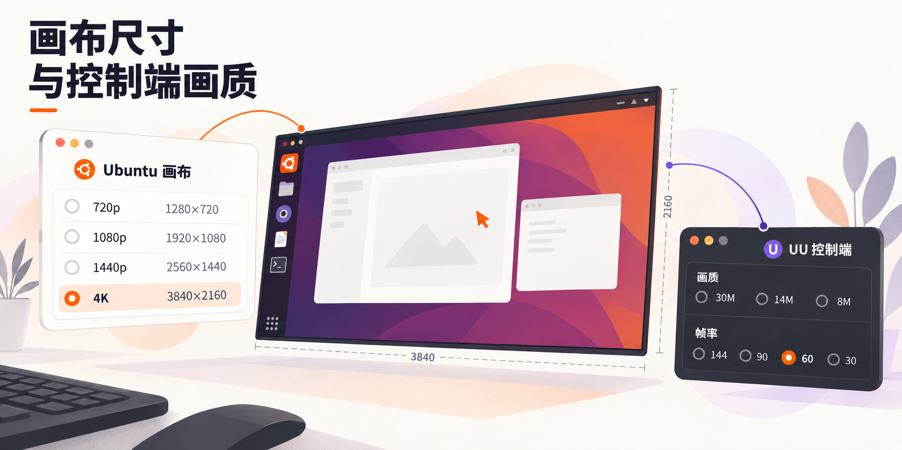

<div align="center">

[English](../README.md) · [العربية](README.ar.md) · [Español](README.es.md) · [Français](README.fr.md) · [日本語](README.ja.md) · [한국어](README.ko.md) · [Tiếng Việt](README.vi.md) · [中文 (简体)](README.zh-Hans.md) · [中文（繁體）](README.zh-Hant.md) · [Deutsch](README.de.md) · [Русский](README.ru.md)

<a href="README.zh-Hans.md"></a>

# UU Remote Ubuntu Plus

**灵感随时上线，开发环境留在 Ubuntu。**

编辑器、终端和应用会话留在 Ubuntu；从手机、Mac 或 Windows 连接回来，随心 Vibe Coding，换个屏幕接着开写。

[](../docs/i18n/zh-Hans/ubuntu-26.04-port.md)
[](../docs/i18n/zh-Hans/architecture.md)
[](../patches/uu-remote-4.42.0.2770.json)
[](../LICENSE)



[安装](#快速安装) · [功能](#功能与具体改善) · [工作原理](#技术总览) · [画质](#画质与分辨率) · [支持项目](#支持项目)

</div>

Plus 把网易 UU 远程连接到已经登录的 Ubuntu GNOME 桌面。官方 Windows UU 应用
运行在专用 Wine 环境中，本机中继呈现真实桌面，独立管理窗口提供账号与设置操作。
本地使用与远程连接共享同一个桌面会话、应用和文件。

项目基于 **[Lachlan Chen 的 UU Remote Ubuntu Bridge](https://github.com/lachlanchen/uu-remote-ubuntu-bridge)**。
Plus 继续适配新版 Ubuntu 和 UU，提供四档画布设置，修正输入与剪贴板问题，
并改善管理窗口和日常桌面操作。

现有安装器面向 x86-64 Ubuntu 24.04 / GNOME 46 和 Ubuntu 26.04 / GNOME 50，采用 UU 4.42.0.2770。首次安装默认选择 1080p，可选光标保护关闭。

十一种语言的首页与技术指南介绍 Plus，可沿同语链接继续阅读；英文版是原始参考。

## 从安装到远程使用

1. 在 Ubuntu 桌面安装桥接器。
2. 运行 `uu-remote open`，在本地管理窗口登录 UU。
3. 从手机、Mac 或 Windows 的 UU 控制端连接这台 Ubuntu。
4. 选择画布尺寸，使用平时的桌面应用。

## 功能与具体改善

上游提供了 UU 与 Ubuntu 之间的桌面中继、键鼠输入、手机输入法处理和服务恢复。Plus 在这条基础上，把新版适配、画质选择和日常操作继续打磨。

| 日常场景 | Plus 的改进 |
| --- | --- |
| 新版 Ubuntu 与 UU | 适配 Ubuntu 26.04 / GNOME 50 和 UU 4.42，保留 Ubuntu 24.04 安装路径。 |
| 选一块合适的画布 | 在图形界面切换 720p、1080p、1440p 和 4K；完整桌面缩放到所选画布，保存的设置可恢复。 |
| 中文、代码和复制粘贴 | 修正手机中文提交与剪贴板更新，让新文本及时进入桌面，代码片段和多行文本按原样传递。 |
| 打开设置，桌面照常在线 | UU 管理窗口与弹窗独立捕获；关闭查看器后，操作焦点回到桌面中继。 |
| 本地工具更顺手 | 提供画质、VNC、FreeRDP 与 Openbox 工具入口，调整工具字体、DPI 和启动行为。 |
| 安装与维护 | 从固定源码构建中继组件，安装前检查运行组件；画布切换失败可恢复，卸载前可预览变更。 |

具体差异与版本背景见[上游对比](../docs/i18n/zh-Hans/upstream-comparison.md)。


[体验与测量](../docs/i18n/zh-Hans/performance-evidence.md)

## 快速安装

使用已登录 GNOME 桌面的 x86-64 Ubuntu 被控端，先获取项目源码：

```bash
git clone https://github.com/llmir/uu-remote-ubuntu-plus.git
cd uu-remote-ubuntu-plus
```

安装需要已审核工具链构建的中继，或与产品配置匹配的已验证输出；源码包不含中继二进制。Ubuntu 26.04 提供参考工具准备入口，Ubuntu 24.04 使用已验证输出复用路径。 [工具链准备与中继复用](../docs/i18n/zh-Hans/source-build.md#reference-toolchain)

工具或匹配输出准备好后，运行普通安装器：

```bash
./install.sh
./scripts/verify.sh --quick
uu-remote open
```

安装器准备依赖、编译兼容组件、配置 GNOME Remote Desktop 并启动用户服务。
首次安装会询问中继密码，将其保存到 GNOME Keyring，然后打开 UU 完成账号登录。
重新安装会保留已保存设置与现有 UU 账号状态。

首次安装默认 1080p，可选光标保护关闭。希望从 4K 开始可运行：

```bash
./install.sh --resolution 3840x2160
```

通过[兼容性反馈表](https://github.com/llmir/uu-remote-ubuntu-plus/issues/new?template=compatibility.yml)提供环境信息与可复现行为。

首次安装可能下载并编译源码依赖。环境要求见[源码构建](../docs/i18n/zh-Hans/source-build.md)，
隔离设计见[安全说明](../docs/i18n/zh-Hans/security.md)。

从网易官方 [uuyc.163.com](https://uuyc.163.com/) 获取 Windows 版 UU，由桥接器在专用 Wine 环境中运行。UU 使用其原有许可证。

## 技术总览



Ubuntu 桌面通过 GNOME RDP 进入 SDL / FreeRDP 中继，再交给 UU 传送到控制端；键鼠操作沿输入桥返回同一个桌面会话。UU 账号与设置走独立的本地管理窗口。

用 `uu-remote open` 打开管理窗口，关闭查看器后桌面桥继续运行。可选的 `uu-remote console` 提供本地浏览器视图。模块与输入路径见[架构说明](../docs/i18n/zh-Hans/architecture.md)。

## 画质与分辨率



在 GNOME 应用列表打开 **UU Remote 画质与分辨率**，或运行：

```bash
uu-remote quality gui
```

画布缩放显示完整源桌面，物理显示器分辨率保持原样。应用另一档会短暂重连，
切换失败时恢复原配置。

```bash
uu-remote quality list
uu-remote quality apply 2160p
uu-remote quality status
uu-remote quality guide
```

UU 编码画质、FPS 和真彩在**控制端**设置：电脑使用**控制中心 → 画质**，
手机使用**操作 → 显示**。

桥接器另提供码率上限：

```bash
uu-remote quality bitrate 20
uu-remote quality bitrate 0
```

`20` 设置 20 Mbps 上限，`0` 取消上限。画布尺寸、编码画质、请求 FPS 和码率分别设置。
具体选择见[画质指南](../docs/i18n/zh-Hans/quality-guide.md)。

## 键盘、剪贴板与光标

手机输入法提交的中文、代码片段和多行文字通过文本路径进入 Ubuntu；实体键盘和快捷键保留按键事件。Plus 修正了输入提交与剪贴板刷新，让日常输入和文字复制粘贴更顺手。输入模式见[键盘中继说明](../docs/i18n/zh-Hans/adaptive-keyboard-relays.md)。

光标保护是上游的可选功能，Plus 增加光标资源处理和相关修正。
在专用 UU Wine 环境中启用：

```bash
./install.sh --skip-packages --skip-account-login   --cursor-guard on --cursor-size auto
```

`auto` 跟随桌面光标大小，固定值如 `24` 则设置备用光标尺寸。
使用 `--cursor-guard off` 可关闭。重新安装会让 UU 短暂重连。

## 日常使用与维护

```bash
uu-remote status
uu-remote network
uu-remote logs
uu-remote restart
uu-remote stop
```

用 `uu-remote open` 打开管理窗口，`uu-remote login` 完成账号登录或恢复。
重启、登录和重新安装都会让控制端短暂断线。

更新源码前保存本地改动，更新工作区后运行：

```bash
./install.sh --skip-packages --skip-account-login
./scripts/verify.sh --quick
```

运行源码的改动在重新安装后生效。`uu-remote upgrade` 见[升级说明](../docs/i18n/zh-Hans/reusable-upgrade.md)，
可选自动维护见[自动更新](../docs/i18n/zh-Hans/automatic-updates.md)。

卸载桥接组件并保留专用 UU 账号状态：

```bash
./uninstall.sh --dry-run
./uninstall.sh
```

`./uninstall.sh --purge` 还会删除专用 Wine 前缀、中继凭据和 GNOME RDP 启用配置。

## 更多 Linux 与迁移

现有安装器面向 x86-64 Ubuntu 24.04 和 26.04。[Linux 迁移指南](../docs/i18n/zh-Hans/porting.md)把其他发行版的适配分为三层：

- 复用 UU 兼容、画面中继和输入核心。
- 调整发行版软件包、Wine 路径和服务集成。
- 对接桌面专属的捕获、输入、显示模式和操作后端。

其他 GNOME 发行版可以复用更多现有桌面集成；KDE、Xfce 则需要对应的桌面后端。

## 技术文档与贡献

- [画质与分辨率](../docs/i18n/zh-Hans/quality-guide.md)
- [源码构建](../docs/i18n/zh-Hans/source-build.md)与[Ubuntu 26.04 适配](../docs/i18n/zh-Hans/ubuntu-26.04-port.md)
- [架构](../docs/i18n/zh-Hans/architecture.md)与[安全说明](../docs/i18n/zh-Hans/security.md)
- [上游对比](../docs/i18n/zh-Hans/upstream-comparison.md)与[测量说明](../docs/i18n/zh-Hans/performance-evidence.md)
- [故障排查](../docs/i18n/zh-Hans/troubleshooting.md)
- [改动记录](CHANGELOG.zh-Hans.md)与[贡献指南](CONTRIBUTING.zh-Hans.md)

说明版本、所选设置和可复现行为。

## 支持项目

**用得顺手，请我喝杯咖啡 ☕**

UU 和 Ubuntu 都在更新，Plus 也会接着跟进。你的支持会用来测试新版本、补齐兼容性，分担开发工具和 Token 的开销，把中文输入、剪贴板和画质继续磨好。

| PayPal | 支付宝 · CNY | AlipayHK · HKD | 微信 · 中文码 | 微信 · HKD |
| :---: | :---: | :---: | :---: | :---: |
| <a href="https://paypal.me/mirmirlin"></a> | <a href="../docs/images/support/alipay-cny.jpg"></a> | <a href="../docs/images/support/alipay-hkd.png"></a> | <a href="../docs/images/support/wechat-zh.png"></a> | <a href="../docs/images/support/wechat-en.png"></a> |

<details>
<summary>支付宝与微信收款码</summary>

<p><a href="../docs/i18n/zh-Hans/support.md#alipay-cny">支付宝 CNY</a><br><a href="../docs/images/support/alipay-cny.jpg"></a></p>

<p><a href="../docs/i18n/zh-Hans/support.md#alipay-hkd">AlipayHK HKD</a><br><a href="../docs/images/support/alipay-hkd.png"></a></p>

<p><a href="../docs/i18n/zh-Hans/support.md#wechat-zh">微信中文版</a><br><a href="../docs/images/support/wechat-zh.png"></a></p>

<p><a href="../docs/i18n/zh-Hans/support.md#wechat-en">微信 · HKD</a><br><a href="../docs/images/support/wechat-en.png"></a></p>

</details>

有复现步骤、Linux 适配经验或一份 PR，也欢迎直接带来。一起把下一版做得更顺手。

[支持 UU Remote Ubuntu Plus](../docs/i18n/zh-Hans/support.md)

## 致谢与许可证

基于 **[Lachlan Chen 的 UU Remote Ubuntu Bridge](https://github.com/lachlanchen/uu-remote-ubuntu-bridge)**。
保留原始版权声明与 [MIT 许可证](../LICENSE)。
UU 远程及其他依赖保留各自许可证和商标。本项目由独立社区维护。

支付品牌图标来自 [Simple Icons](https://simpleicons.org/)（CC0）；第三方品牌保留其商标权利。
