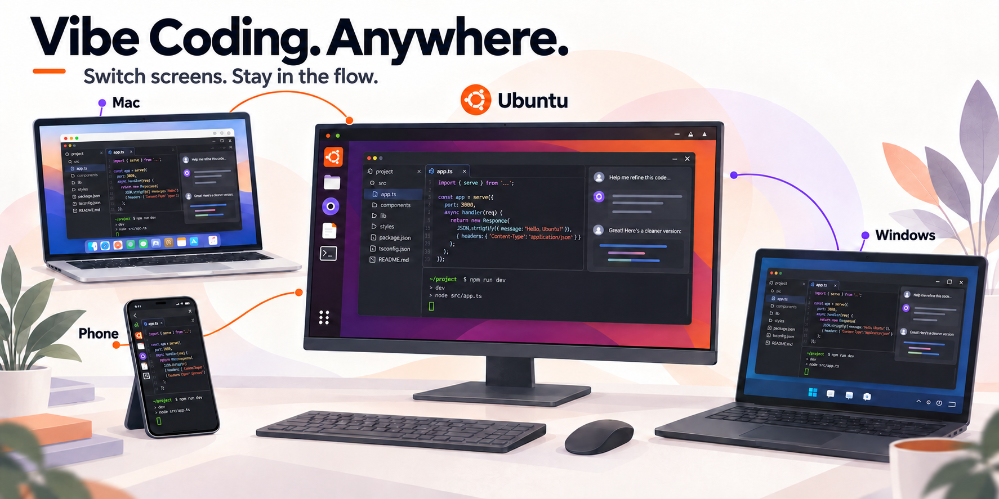
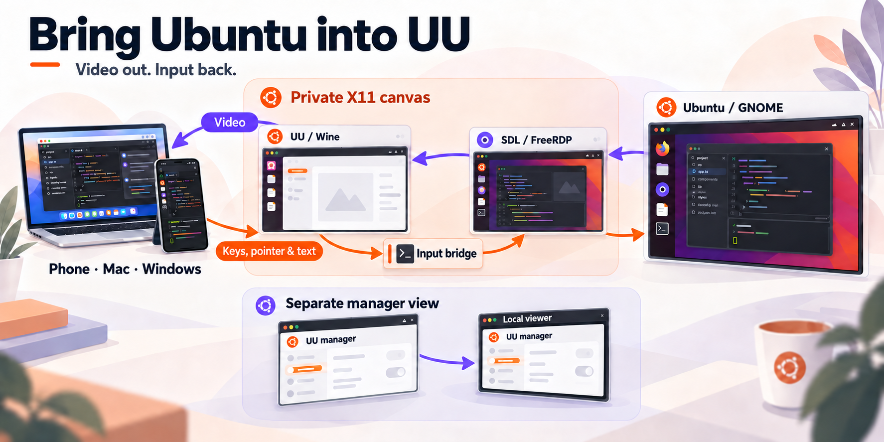
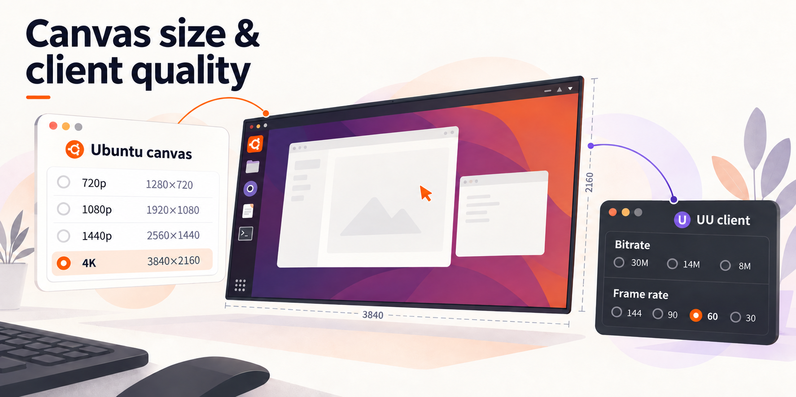

<div align="center">

[English](../README.md) · [العربية](README.ar.md) · [Español](README.es.md) · [Français](README.fr.md) · [日本語](README.ja.md) · [한국어](README.ko.md) · [Tiếng Việt](README.vi.md) · [中文 (简体)](README.zh-Hans.md) · [中文（繁體）](README.zh-Hant.md) · [Deutsch](README.de.md) · [Русский](README.ru.md)

<a href="README.zh-Hant.md"></a>

# UU Remote Ubuntu Plus

**靈感隨時上線，開發環境留在 Ubuntu。**

編輯器、終端機和應用程式工作階段留在 Ubuntu；從手機、Mac 或 Windows 連回來，隨心 Vibe Coding，換個螢幕接著開寫。

[](../docs/i18n/zh-Hant/ubuntu-26.04-port.md)
[](../docs/i18n/zh-Hant/architecture.md)
[](../patches/uu-remote-4.42.0.2770.json)
[](../LICENSE)



</div>

Plus 把網易 UU 遠端連線到已登入的 Ubuntu GNOME 桌面。
官方 Windows UU 應用程式在專用 Wine 環境中執行，本機中繼呈現真實桌面，
獨立管理視窗提供帳號與設定操作。本機使用和遠端連線共用同一個桌面階段、應用程式與檔案。

專案基於 **[Lachlan Chen 的 UU Remote Ubuntu Bridge](https://github.com/lachlanchen/uu-remote-ubuntu-bridge)**。
Plus 繼續支援新版 Ubuntu 和 UU，提供四種畫布尺寸，修正輸入與剪貼簿問題，
並改善管理視窗和日常桌面操作。

現有安裝程式面向 x86-64 Ubuntu 24.04 / GNOME 46 和 Ubuntu 26.04 / GNOME 50，採用 UU 4.42.0.2770。首次安裝預設選擇 1080p，選用游標保護關閉。

十一種語言的首頁與技術指南介紹 Plus，可沿同語連結繼續閱讀；英文版為原始參考。

## 0.2.0-work 更新了什麼

- **終端斷線後接著用：**可選 `persistent` 模式讓重連回到原 shell、目錄與工作，安裝預設仍為 `fresh`。

- **一次接收多個檔案：**在控制端複製普通檔案，接收完成後貼到 Ubuntu 檔案管理器；顯示實際位元組進度。

- **圖片格式相容：**保留原始 PNG 與 DIBV5／DIB，可選 Mac 助手為 PNG 補充 TIFF。

- **原生擷取探索：**可選 CPU／GPU 原型目前仍屬實驗，不包含在預設安裝。

[CPU (MIT)](../vendor/uur-native-cpu/NOTICE) · [GPU (AGPL-3.0)](../vendor/uuway-gpu-component/README.md)


僅支援普通檔案入站；目前 Ubuntu → Mac 圖片同步與雙控制端焦點仍待解決。

[使用與更新說明（英文）](../docs/updates/2026-10-06.md) · [SVG](../docs/images/uu-plus-update-20261006-en.svg)

## 從安裝到遠端使用

1. 在 Ubuntu 桌面安裝橋接程式。
2. 執行 `uu-remote open`，在本機管理視窗登入 UU。
3. 從手機、Mac 或 Windows 的 UU 控制端連線這台 Ubuntu。
4. 選擇畫布尺寸，使用平時的桌面應用程式。

## 功能與具體改善

上游提供了 UU 與 Ubuntu 之間的桌面中繼、鍵盤滑鼠、手機輸入法處理和服務復原。Plus 在這套基礎上繼續完善新版支援、畫質選擇和日常操作。

| 日常情境 | Plus 的改善 |
| --- | --- |
| 新版 Ubuntu 與 UU | 支援 Ubuntu 26.04 / GNOME 50 和 UU 4.42，保留 Ubuntu 24.04 安裝路徑。 |
| 選擇合適的畫布 | 在圖形介面切換 720p、1080p、1440p、4K；完整桌面縮放到所選畫布，已儲存設定可復原。 |
| 中文、程式碼和複製貼上 | 修正手機中文提交與剪貼簿更新，讓新文字進入桌面，程式碼片段和多行文字保持原樣。 |
| 開啟設定，桌面持續在線 | UU 管理視窗與選單獨立擷取；雙控制端切換的焦點丟失仍未解決。 |
| 本機工具更順手 | 提供畫質、VNC、FreeRDP、Openbox 工具入口，改善字型、DPI 和啟動方式。 |
| 安裝與維護 | 從固定原始碼建置中繼，安裝前檢查執行元件；畫布切換失敗可復原，移除前可預覽變更。 |

具體差異與版本背景見[上游比較](../docs/i18n/zh-Hant/upstream-comparison.md)。


[體驗與測量](../docs/i18n/zh-Hant/performance-evidence.md)

## 快速安裝

使用已登入 GNOME 桌面的 x86-64 Ubuntu 被控端，先取得專案原始碼：

```bash
git clone https://github.com/llmir/uu-remote-ubuntu-plus.git
cd uu-remote-ubuntu-plus
```

安裝需要經審核工具鏈建置的中繼，或符合產品設定的已有驗證輸出；原始碼包不含中繼二進位檔。Ubuntu 26.04 提供參考工具準備入口，Ubuntu 24.04 使用驗證輸出重用路徑。 [工具鏈準備與中繼重用](../docs/i18n/zh-Hant/source-build.md#reference-toolchain)

工具或相符輸出準備好後，執行一般安裝程式：

```bash
./install.sh
./scripts/verify.sh --quick
uu-remote open
```

安裝程式準備相依套件、建置元件、設定 GNOME Remote Desktop 並啟動使用者服務。
中繼密碼儲存在 GNOME Keyring，接著開啟 UU 完成帳號登入。
重新安裝保留已儲存設定與帳號狀態。希望從 4K 開始：

```bash
./install.sh --resolution 3840x2160
```

透過[相容性回報表](https://github.com/llmir/uu-remote-ubuntu-plus/issues/new?template=compatibility.yml)提供環境資訊與可重現行為。

首次安裝可能下載並編譯相依原始碼。參考
[原始碼建置](../docs/i18n/zh-Hant/source-build.md)和[安全設計](../docs/i18n/zh-Hant/security.md)。
從網易官方 [uuyc.163.com](https://uuyc.163.com/) 取得 Windows 版 UU，由橋接程式在專用 Wine 環境執行。UU 使用其原有授權。

## 技術總覽



Ubuntu 桌面經由 GNOME RDP 進入 SDL / FreeRDP 中繼，再由 UU 傳送到控制端；鍵鼠操作沿輸入橋返回同一個桌面階段。UU 帳號和設定使用獨立的本機管理視窗。

用 `uu-remote open` 開啟管理視窗，關閉檢視器後橋接程式持續執行。選用 `uu-remote console` 提供本機瀏覽器檢視。模組和輸入路徑見[架構說明](../docs/i18n/zh-Hant/architecture.md)。

## 畫質與解析度



在 GNOME 開啟 **UU Remote 画质与分辨率**，或執行：

```bash
uu-remote quality gui
```

完整來源桌面縮放到畫布，實體顯示器解析度保持原樣。
切換預設會短暫重新連線；失敗時回復原設定。

```bash
uu-remote quality list
uu-remote quality apply 2160p
uu-remote quality status
uu-remote quality guide
```

編碼畫質、FPS 和真彩在 **UU 控制端**設定：
電腦使用**控制中心 → 畫質**，手機使用**操作 → 顯示**。

位元率上限另外設定：

```bash
uu-remote quality bitrate 20
uu-remote quality bitrate 0
```

`20` 要求 20 Mbps 上限，`0` 取消上限。
畫布、畫質、要求 FPS 和位元率各自設定。
選擇方法見[畫質指南](../docs/i18n/zh-Hant/quality-guide.md)。

## 輸入與游標

手機輸入法提交的中文、程式碼片段和多行文字透過文字路徑進入 Ubuntu；實體鍵盤和快捷鍵保留按鍵事件。Plus 修正輸入提交與剪貼簿更新，讓日常輸入和文字複製貼上更順手。輸入模式見[鍵盤中繼](../docs/i18n/zh-Hant/adaptive-keyboard-relays.md)。

選用游標保護來自上游，Plus 改善游標資源及處理。
啟用方式：

```bash
./install.sh --skip-packages --skip-account-login \
  --cursor-guard on --cursor-size auto
```

`auto` 跟隨桌面游標大小，固定值如 `24` 則設定備用游標尺寸。
用 `--cursor-guard off` 可關閉。重新安裝會讓 UU 短暫重新連線。

## 日常使用與維護

```bash
uu-remote status
uu-remote network
uu-remote logs
uu-remote restart
uu-remote stop
```

以 `uu-remote open` 開啟管理視窗，`uu-remote login` 登入或復原帳號。
重新啟動、登入與重新安裝會短暫中斷遠端連線。

保存本機修改、更新原始碼後重新安裝：

```bash
./install.sh --skip-packages --skip-account-login
./scripts/verify.sh --quick
```

執行程式碼的改動在重新安裝後生效。
`uu-remote upgrade` 見[升級](../docs/i18n/zh-Hant/reusable-upgrade.md)，
選用自動維護見[自動更新](../docs/i18n/zh-Hant/automatic-updates.md)。

移除橋接程式並保留 UU 帳號狀態：

```bash
./uninstall.sh --dry-run
./uninstall.sh
```

`./uninstall.sh --purge` 也會刪除專用 Wine prefix、中繼憑證與 GNOME RDP 啟用設定。

## 更多 Linux 與移植

現有安裝程式面向 x86-64 Ubuntu 24.04 和 26.04。[Linux 移植指南](../docs/i18n/zh-Hant/porting.md)把其他發行版的移植分為三層：

- 重用 UU 相容、中繼和輸入核心。
- 調整發行版套件、Wine 路徑與服務整合。
- 連接桌面專屬的擷取、輸入、顯示模式和操作後端。

其他 GNOME 發行版可以重用更多既有整合；KDE、Xfce 則需要對應的桌面後端。

## 文件與貢獻

- [畫質](../docs/i18n/zh-Hant/quality-guide.md)、[建置](../docs/i18n/zh-Hant/source-build.md)、[Ubuntu 26.04](../docs/i18n/zh-Hant/ubuntu-26.04-port.md)
- [架構](../docs/i18n/zh-Hant/architecture.md)、[安全](../docs/i18n/zh-Hant/security.md)、[疑難排解](../docs/i18n/zh-Hant/troubleshooting.md)
- [上游比較](../docs/i18n/zh-Hant/upstream-comparison.md)、[測量](../docs/i18n/zh-Hant/performance-evidence.md)
- [變更記錄](CHANGELOG.zh-Hant.md)、[貢獻指南](CONTRIBUTING.zh-Hant.md)

提供版本、設定及可重現的操作步驟。

## 支持專案

**用得順手，請我喝杯咖啡 ☕**

UU 和 Ubuntu 都在更新，Plus 也會繼續跟進。你的支持會用來測試新版本、補齊相容性，分擔開發工具和 Token 的開銷，把中文輸入、剪貼簿和畫質繼續磨好。

| PayPal | 支付寶 · CNY | AlipayHK · HKD | 微信 · CNY | 微信 · HKD |
| :---: | :---: | :---: | :---: | :---: |
| <a href="https://paypal.me/mirmirlin"></a> | <a href="../docs/images/support/alipay-cny.jpg"></a> | <a href="../docs/images/support/alipay-hkd.png"></a> | <a href="../docs/images/support/wechat-zh.png"></a> | <a href="../docs/images/support/wechat-en.png"></a> |

<details>
<summary>支付寶與微信收款碼</summary>

<p><a href="../docs/i18n/zh-Hant/support.md#alipay-cny">支付寶 CNY</a><br><a href="../docs/images/support/alipay-cny.jpg"></a></p>

<p><a href="../docs/i18n/zh-Hant/support.md#alipay-hkd">AlipayHK HKD</a><br><a href="../docs/images/support/alipay-hkd.png"></a></p>

<p><a href="../docs/i18n/zh-Hant/support.md#wechat-zh">微信 · CNY</a><br><a href="../docs/images/support/wechat-zh.png"></a></p>

<p><a href="../docs/i18n/zh-Hant/support.md#wechat-en">微信 · HKD</a><br><a href="../docs/images/support/wechat-en.png"></a></p>

</details>

有重現步驟、Linux 移植經驗或一份 PR，也歡迎直接帶來。一起把下一版做得更順手。

[支持 UU Remote Ubuntu Plus](../docs/i18n/zh-Hant/support.md)

## 致謝與授權

基於 **[Lachlan Chen 的 UU Remote Ubuntu Bridge](https://github.com/lachlanchen/uu-remote-ubuntu-bridge)**。
保留原始著作權聲明與 [MIT 授權](../LICENSE)。
UU 與相依軟體保留各自授權和商標。本專案由獨立社群維護。

付款品牌圖示來自 [Simple Icons](https://simpleicons.org/)（CC0）；第三方品牌保留其商標權利。
